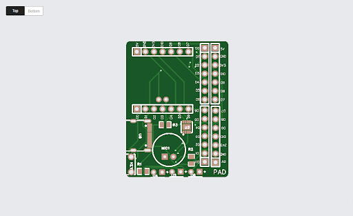

# Hardware Information

This README file is dedicated to providing all the relative information regarding the hardware for the Personal Alert Device. This includes documentation on the enclosure, charging stand, information regarding the power system, the sensors we used, and a breakdown of the cost for all the parts included in our project.

## Relevant Files For CAD Drawings and Assemblies

- [Body of Enclosure Drawing](./PDFs/Body_Drawing.pdf)  
  The PDF file above depicts the body of the enclosure and includes notable measurements for the device in millimeters. This is the central part of the enclosure, as it houses all of the sensors, the PCB, and the device’s battery. The holes in the enclosure are for the LEDs, USB-C, and a button.

- [Bottom of Enclosure Drawing](./PDFs/Bottom_Drawing.pdf)  
  The PDF file above depicts the bottom of the enclosure. There are holes included on the bottom for magnets and for the wireless charging coil. There is also a window cut-out for wires to pass through, including the coil from the battery, the jumper cables for the heart rate sensor, and the thermistor. The length and width of the bottom also match the measurements for the body.

- [Charging-Stand Drawing](./PDFs/Charging-Stand_Drawing.pdf)  
  The PDF file above shows the wireless charging stand used for our device. The bottom of the enclosure sits on top of the stand and uses magnets to ensure proper connection. The coil also sits on top of the charging stand to stay in place. The port connection is what’s stored inside the charging stand and also offers support to the stand.

- [PAD OnShape File](https://bu.onshape.com/documents/028d79f541c7e4d4f72e95ac/w/96d4ac62ff30451bad3e9328/e/472430a287832b7987da914a?renderMode=0&uiState=6809a08bf0e943499a3269d9)  
  The link above will direct you to the OnShape file containing all of the drawings above, as well as the actual CAD assemblies for the body, bottom, and top of the enclosure and the charging stand.

## Images of the Full Assembly and PCB

## Bill of Materials

