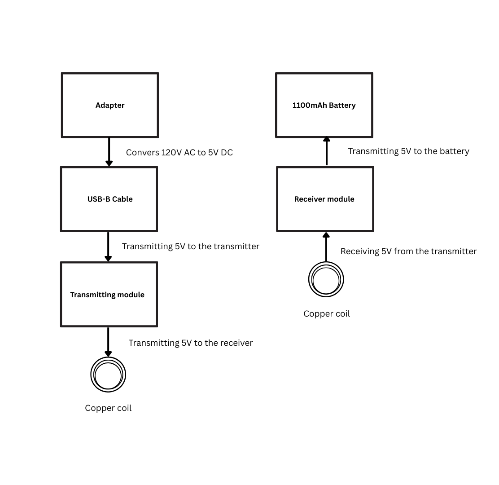
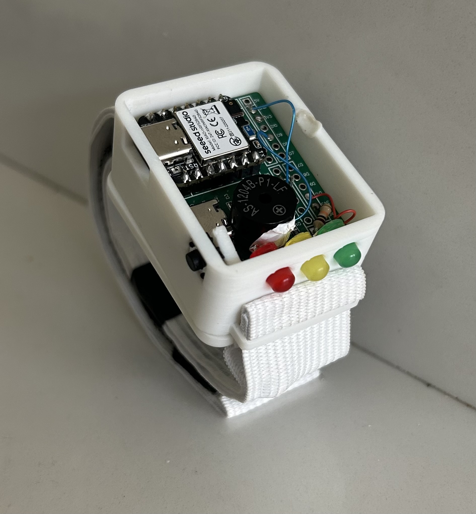
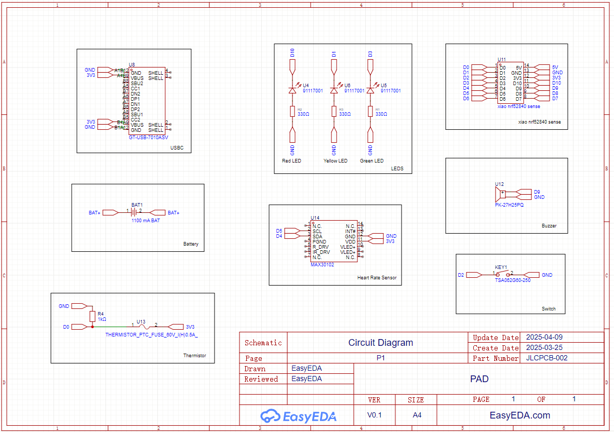
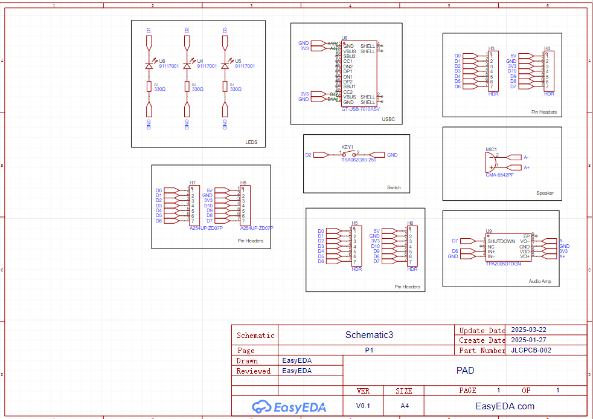
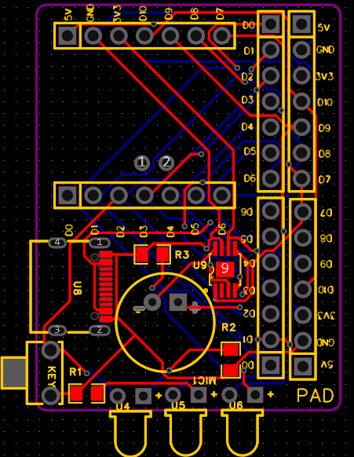
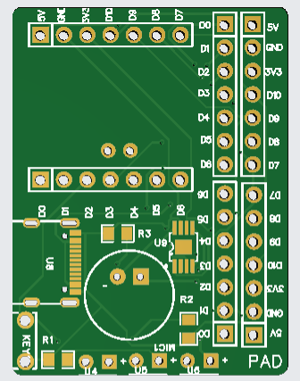
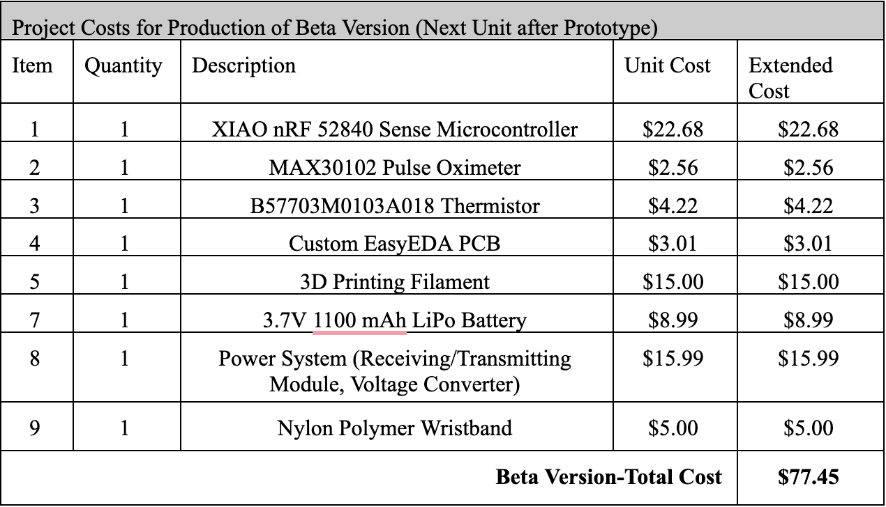
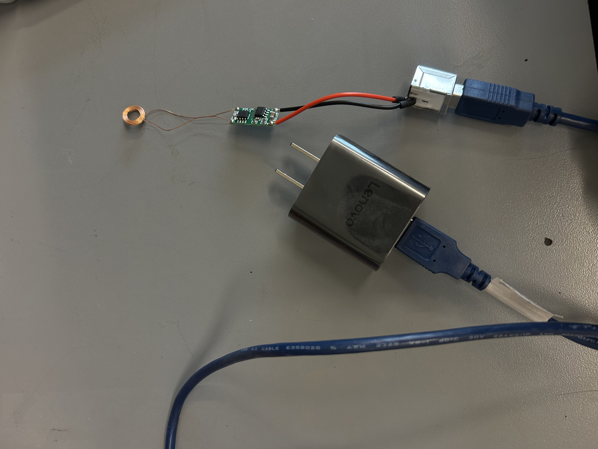
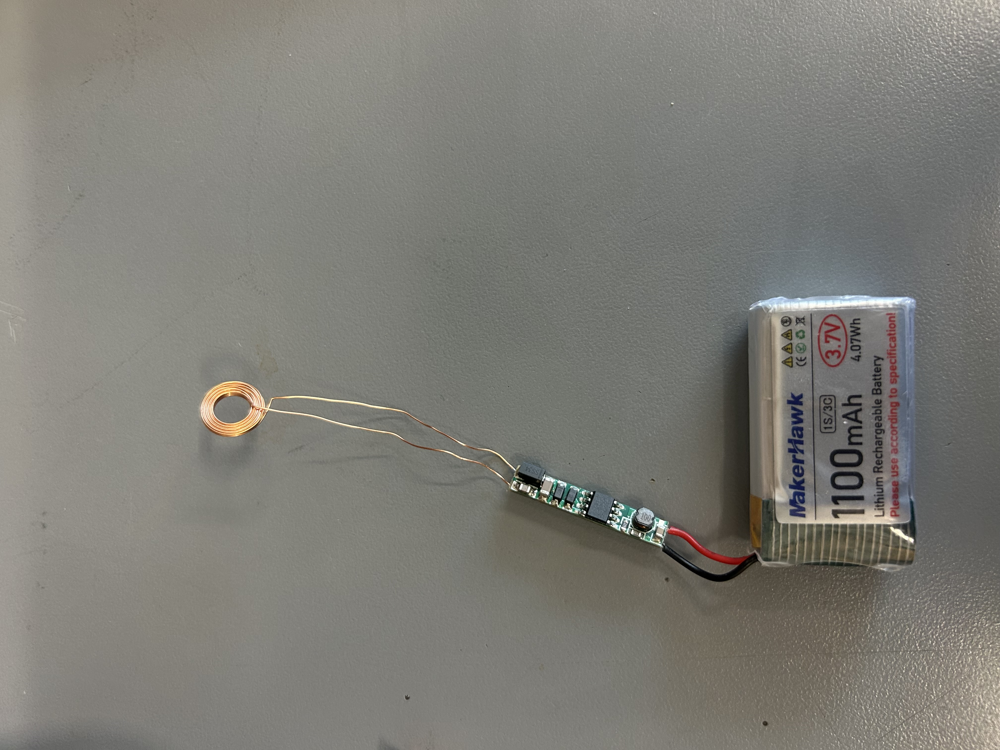

# Hardware Information

This README file is dedicated to providing all the relative information regarding the hardware for the Personal Alert Device. This includes documentation on the enclosure, charging stand, information regarding the power system, the sensors we used, and a breakdown of the cost for all the parts included in our project.

## Hardware Components

  
## Wiring and Sensor Connections

MAX30102 heart rate sensor 
- SCL: D4 (GPIO pin on XIAO)
- SDA: D5
- VCC: 3.3V
- GND: GND
  
Temperature sensor
- One terminal connected to D1,  a 1k ohm resistor, and to GND
- one terminal to 3.3 V

Push Button
- One terminal to D2
- Other terminal to GND

Wireless Charging Receiver
- 5V output: to the positive battery terminal
- GND to the battery ground

LEDs
- Red: Positive terminal to D10, and negative terminal to 330 ohm  and to GND
- Yellow: Positive terminal to D3, and negative terminal to 330 ohm and to GND
- Green: Positive terminal to D1, and negative terminal to 330 ohm and to GND
Buzzer
- one terminal is connected to D9
- one terminal is connected to GND
Setup Instructions

1/Solder the positive terminal of the battery to the postive terminal of the receiver module and solder the negative terminal of the battery to the negative terminal of the receiver module
2/Solder the positive terminal of the battery to the BAT+ of the microconterller and the negative terminal of the battery to the BAT- of the microconterller
3/ Solder all buzzer, LEDS, push-button switch, and microcontroller on the PCB
4/ Connect the heart rate sensor and the thirmistor per wiring table
5/ 3D-printed enclosure the enclourser for the device and the powering system

## Relevant Files For CAD Drawings and Assemblies

- [Body of Enclosure Drawing](./PDFs/Body_Drawing.pdf)  
  The PDF file above depicts the body of the enclosure and includes notable measurements for the device in millimeters. This is the central part of the enclosure, as it houses all of the sensors, the PCB, and the device’s battery. The holes in the enclosure are for the LEDs, USB-C, and a button.

- [Bottom of Enclosure Drawing](./PDFs/Bottom_Drawing.pdf)  
  The PDF file above depicts the bottom of the enclosure. There are holes included on the bottom for magnets and for the wireless charging coil. There is also a window cut-out for wires to pass through, including the coil from the battery, the jumper cables for the heart rate sensor, and the thermistor. The length and width of the bottom also match the measurements for the body.

- [Charging-Stand Drawing](./PDFs/Charging-Stand_Drawing.pdf)  
  The PDF file above shows the wireless charging stand used for our device. The bottom of the enclosure sits on top of the stand and uses magnets to ensure proper connection. The coil also sits on top of the charging stand to stay in place. The port connection is what’s stored inside the charging stand and also offers support to the stand.

- [PAD OnShape File](https://bu.onshape.com/documents/028d79f541c7e4d4f72e95ac/w/96d4ac62ff30451bad3e9328/e/472430a287832b7987da914a?renderMode=0&uiState=6809a08bf0e943499a3269d9)  
  The link above will direct you to the OnShape file containing all of the drawings above, as well as the actual CAD assemblies for the body, bottom, and top of the enclosure and the charging stand.

## Images of the Full Assembly and PCB

The image above shows the enclosure with its exposed interior, we can see the microcontroller, buzzer, PCB, and some of the wiring for the sensors. For more information on sensor connections, see the image below of our wiring diagram. For more information on the sensors we used, see the Sensors and Other Hardware Equipment section at the end of this file.
  

The image above depics the device fully assembled with all of the sensors installed, this is the most recent build of our device. Although you can't see the interior, the enclosure houses the PCB, microcontroller, a buzzer, LEDs, a button, the battery which sits beneath the PCB, and connections for the heart rate sensor and thermistor which are inside of the watch band.
  

The image above is the wiring diagram for the full device. It shows how all the components are connected to the microcontroller.
  

The image above is the wiring diagram for the PCB, showing how the LEDs, the push button switch, and the buzzer are connected to the microcontroller.  
  

This image above shows the 2-D layout of the PCB.
  

The image above is a schematic of the PCB we used and designed using Easy EDA. 

----
## Bill of Materials

The image above provides a breakdown of the total price for the device, along with a list of the parts we used and the quantity of parts in the final design. 
## Sensors and Other Hardware Equipment Used
Below you will find a list of the sensors we used for our device as well as the datasheets from their respective manufactures' page.
  
[Seeed Studio XIAO nRF52840 Sense - TinyML/TensorFlow Lite- IMU / Microphone - Bluetooth5.0](./PDFs/microcontroller.pdf)
We chose this microcontroller for its multi-functionality. The microcontroller mainly serves as the hub for all of our sensor code, but it also came equipped with a microphone, which we used for our ML voice recognition model, and bluetooth built in which we were able to use to send our data to our database. The price of the microcontroller was also kept in mind when sourcing parts, and this one came out to $18 USD.
  
[MAX30102 Pulse Oximeter](./PDFs/max30102.pdf)
We chose this heart rate sensor because it was advertised as a sensor you could use in contact with an individual's skin. The heart rate detection range is 50-180 BPM and we believed that was suitable for our device's use case. During our first tests with the sensor we were unable to obtain accurate readings for our BPM compared to reading we found using an apple watch. We concluded that the reason for this faultiness could have been due to the sensor optical lens picking up on light from external sources while testing. Although we originally had trouble gaining accurate sensor data from the heart rate sensor, we were able to calibrate the sensor to pick up heart rate values in the nomral range of 60-85 BPM and also use a rolling average to calculate the heart rate instead of continuos values. Also, to avoid light from external sources interfering with the sensors readings, we decided to house the sensor along the watch band in order for the sensor to only interact with the user's wrist.
  
[3.7V 1100mAh LiPo Battery](./PDFs/battery.pdf)
We chose a 3.7V 1100mAh lithium polymer rechargeable battery for the device because it was well suited to power all system components including the microcontroller, heart rate sensor, temperature sensor, LEDs, and buzzer. We chose the 1100mAh capacity for the battery to increase the device’s operational time providing continuous use for up to 72 hours on a single charge. Additionally, the battery includes a built in protection circuitry to prevent overcharging, overdischarging, and short circuiting, ensuring safe use for daily wear. 
  
[B57703M0103A018 Thermistor](./PDFs/NTC_thermistor.pdf)
We chose this temperature sensor as NTC thermistor's are typically used in thermometers, and it was also one of the only temperature sensors we could find which was able to make contact with the users skin. We had no issues with the thermistor and it was able to provide us with accurate readings of typical room temperature values as well as body temperature values. Similar to the heart rate sensor, the thermistor is also house along the watch band in order to make contact with the user's wrist for accurate sensor values. 
  
The fillament that we used for the 3D printed enclosure and housing stand was Bambu PLA filament. The printer that we used was the Bambu Lab X1E 3D printer which provide us with fast print times and the ability to print multiple parts at once. This was great for iterating on models whenever necessary and made the development of our housing quick and effective. 
  
The material we used for our watch band was nylon polymer and we chose this material as it was a great insulator. The material we chose had to have properties of an insulator since we decided to store the heart rate and thermistor along the watch band. 

  
## Power System

The Personal Alert Device uses a wireless charging power system to provide a user friendly way to recharge the internal battery without requiring manual plugging. The power system consists of a transmitter module and a receiver module. Copper coils are connected to both modules: the transmitter module is powered by a 120V AC to 5V DC adapter, while the receiver coil is directly connected to the battery and embedded inside the wearable device. When the device is placed on the charging stand, power is wirelessly transferred from the transmitter to the receiver, allowing the battery to charge safely and efficiently. This wireless power system design helps protect the internal electronics from water damage and physical wear by minimizing exposed ports, and provides an easy and reliable way for elderly users to recharge the device.

## Power System Images

  
The image above shows the full power system wiring diagram.

  
The image above is the physical setup showing how the AC-DC adapter is connected to the transmitter module.

  
The image above is the physical setup showing how the battery is connected to the wireless receiver module, which is both are embedded inside the wearable device.

---

## Power System Specifications

| Component                  | Voltage | Current | Description                                     |
|-----------------------------|---------|---------|-------------------------------------------------|
| AC-DC Adapter Output        | 120V AC     | 300mA  | Powers the transmitter module                  |
| Wireless Transmitter Module | 5V      | 150-300mA  | Transfers power via inductive coupling          |
| Wireless Receiver Module    | 5V      | 150-300mA | Receives and regulates power to the battery  |
| Lithium Battery             | 3.7-4.2V    | 150-300mA  | Powers the PAD components                      |
| Microcontroller Operating   | 3.7-4.2V  | 50mA   | Drawn from onboard regulator                    |

---

